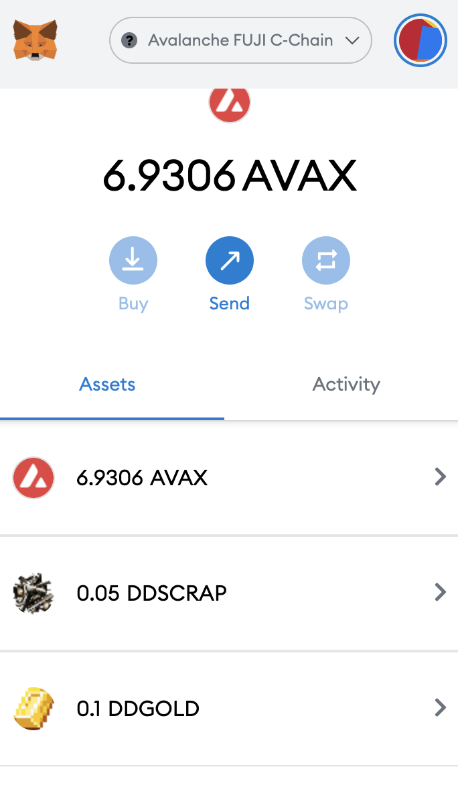

# ⚔ Gameplay Basics

### Chat

Chat with other players (and issue commands to NPCs) by pressing ENTER.

### Character Stats

Your Degen has a number of Stats and Skills which determine your Degen's build and base level.

You can press "T" to view your character's stat page:

.png>)

The stat page shows your stats, skills, and current inventory.

Your character's stats and skills can be permanently increased by using various skills. The lower the skill level is, the easier it is to raise, but the less effective it is. Skills start at 0% but have a maximum cap of 100%.

Every degen has a maximum skill cap of 500%. It is recommended that players choose 5 skills to max at 100% as their "build", but this is of course flexible. The player community should discover on its own the optimal builds for the styles of play they wish to use.

### Saving your Character

As the Degen Dystopia server stores all Degen Data on-chain, you are responsible for saving your own Degen's stats to the blockchain. This is required in order to sell your Degen, as well as redeem rewards from the game

Press 'O' to open the Options dialog and save your character:

.png>)

&#x20;You be prompted to approve the transaction to save your Degen.

### Combat (Basics)

You can attack any of NPCs you see walking around the wasteland (though this might result in your swift death).&#x20;

To engage in combat, click the `war mode()` button, or press **C**. You will see the cursor now with sword indicating your are in war mode.&#x20;

Once in war mode, your cursor will highlight any character you hover over. Click the character to attack!

.png>)

Actively attacking a target will raise your relevant combat skills. Unarmed attacks will raise your power and accuracy, which in turn increase your damage and chance to hit.

Once you have defeated an enemy, some token rewards may drop on the ground. Click them to pick them up before anyone else!

.png>)

You will see the balance of tokens in the loot added to your DEGEN's inventoy.

### Combat (PvP)

You cack other players the same way you attack NPCs in open-pvp zones.

.png>)w

### Death & Resurrection

When you die, 50% of all the unclaimed tokens in your inventory will drop at your feet. These can be looted by an ally or an enemy player, so watch out!

When you die, your character will turn into a Ghost and you will be unable to do anything other than move.

.png>)

Make your way to a `wandering healer`, and speak the phrase "res me" to get resurrected back to life

.png>)

.png>)

Your health will take some time to regenerate on its own.

### Withdrawing Tokens from the game

You can see any unclaimed rewards you have in your character's inventory:

.png>)

You will need to explore the game to find a Bank Vault, where you can cash out from your in-game inventory to your wallet on-chain:

.png>)

Your character must be saved in order to withdraw. See above for saving your character.

Once you have saved, simply say the word "bank" next to the vault warden:

.png>)

The first time you do this process, you will not see the tokens in your wallet. You can say `/addtoken` to add the DD tokens to your wallet. You will need to do this once each for both SCRAP and GOLD:

.png>) .png>)

&#x20;Once you have withdrawn the tokens, they will be visible in your wallet:

### Crafting (Coming Soon)
