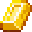

# 🪙 DDGOLD

### **About DDGOLD** ****

DDGOLD is acquired in Degen Dystopia by mining. Mining is a semi-passive activity players can do in Degen Dystopia inside of mines and caves.

DDGOLD is used to craft and upgrade more powerful Dystopians.

DDGOLD will be stakeable in vaults which pay out AVAX over time in proportion to Degen Dystopia’s revenue.

### Supply

The DDGOLD token is a fungible token with a fixed supply hard cap of 1,000,000.

Initially, DDGOLD will begin with 0 circulating supply. The only way to obtain DDGOLD will be to play Degen Dystopia with a DEGEN and earn by using the DEGEN's mining ability. Mining skill can be buffed by arming your DEGEN with certain DYSTOPIANs.

In Phase 2 of the Degen Dystopia roadmap, liquidity pools will be unlocked allowing players and speculators to trade DDGOLD on the open market.

Every DEGEN starts the game with 1 DDGOLD in their inventory.&#x20;

### Future Plans

As Degen Dystopia moves towards a DAO governance model, it is proposed that DDGOLD will act as the game’s governance token.

