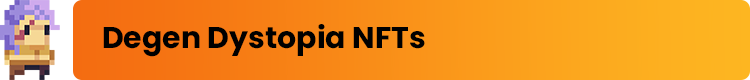

# 💎 NFTs (ERC-721)

Degen Dystopia features two types of NFTs: the core [<mark style="color:orange;">**DEGEN**</mark>](degens.md) token and its accompanying [<mark style="color:purple;">**DYSTOPIAN**</mark>](dystopians.md) token.

[<mark style="color:orange;">**DEGEN**</mark>](degens.md)<mark style="color:orange;">**s**</mark> are the playable characters & core NFT of Degen Dysopia. A single [<mark style="color:orange;">**DEGEN**</mark>](degens.md) is the only token required to play the game. DEGENs have skills which can be leveled up by playing the game, increasing their power and market value.

&#x20;[<mark style="color:purple;">**DYSTOPIAN**</mark>](dystopians.md)<mark style="color:purple;">**s**</mark> are NFTs that can be crafted (minted) using in-game resources collected by  [<mark style="color:orange;">**DEGEN**</mark>](degens.md)<mark style="color:orange;">**s**</mark>. [<mark style="color:purple;">**DYSTOPIAN**</mark>](dystopians.md)<mark style="color:purple;">**s**</mark> serve as the minions of the DEGEN who owns them, providing players support in combat, crafting, resource collection, and other forms of in-game utility.&#x20;

Click on the sub-pages to learn more about each token.
